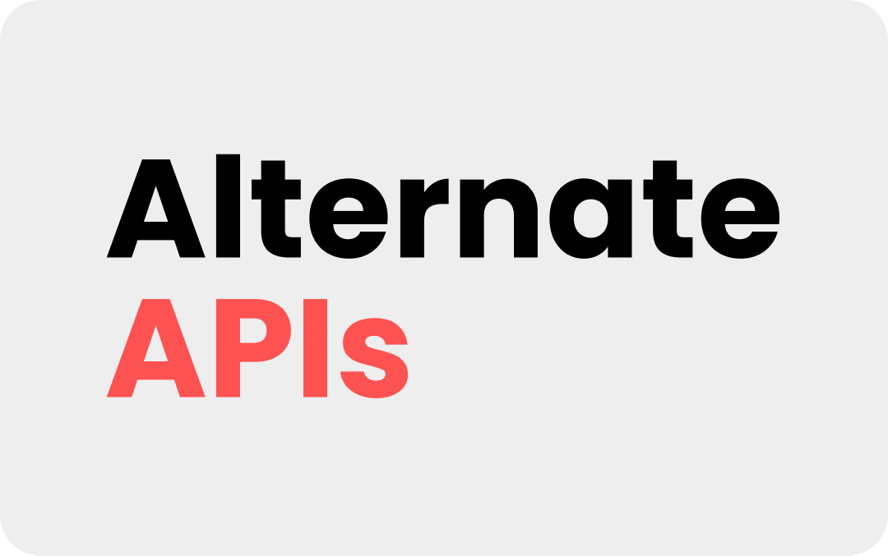

<div align="center">
    
    <p>An APIs written in typescript for Alternate. products</p>
</div>

---

## **Contents**

- [**Contents**](#contents)
- [**Introduction** 🖊️](#introduction-️)
- [**Features** 📝](#features-)
- [**Canceled / Legacy apis** 📦](#canceled--legacy-apis-)
- [**Versions** 📜](#versions-)
- [**Download** ⬇️](#download-️)
- [**License** ⚖️](#license-️)

---

## **Introduction** 🖊️

<!-- Welcome to the Alternate APIs' Repository, Alternate APIs is an APIs used across all our products.

This API is used for most of our latest products, like Timetables, Central Authentication and more. -->

Alternate APIs _(or for short Alt. APIs)_ is the APIs used accross all of our products, the older version of this APIs can be found in the [legacy repository](https://github.com/Alt-Developers/legacy). This repository will only store the API that are still in use.

---

## **Features** 📝

**_Current Version_ | 6.0 (Under Development)** <br/>

**_Auth_**

- Login
- Signup
- Change password
- Change profile picture
- Change profile (Name, color, etc.)
- Get user's configurations

**_System 13_**

- All the player data for System13
- Add players
- Delete players

**_Timetables v3_**

Basically this is the new timetables is the re-written version of Timetables.

- _Timetables Key Feature_
  - Create Timetable
  - Get Timetable
    - Includes
      - Timetable Format (format)
      - Timetable Content (timetableData)
      - Current Class Indicator (indicator)
  - Get Glance (getGlance)
    - Includes
      - Current Class Code (curClass)
      - Next Class Code (nextClass)
      - Timetable Format (format)
    - Holiday
      - Will return PHD (Public Holiday) with name and description of the holiday.
      - For spesific school holiday will return SSH (Specific School Holiday) with name and desc.
  - Timetable Request
  - Get Format
    - **If not** selected will return every format in the system.
    - **Client Can** select what school / program client want.
  - Get My Class
    - Return user's primary class and a list of classes user have starred.
- _Adding Or Remove Class From User_
  - Get Class From School
    - return a class that user still dont have from the school selected.live
  - Register Class
  - Remove Class
    <br />

> **Notes**
>
> The timetalbe format send with every endpoints but getFormat are selected for that school and program, client just need to select the language.

---

## **Canceled / Legacy apis** 📦

**_Expenses_** (CANCELED)

**_Timetables v2_** (Legacy)

- Create timetables
- Add timetable
- Get timetables
- Get user
- Get glance
- Create class
- Get current class indicator

---

## **Versions** 📜

**_Current Version_ | 5.3** <br/>

**_Previous Versions_**

- Version 1.0
  - All basic API features.
- Version 1.1
  - Added errors handling (central error handling middleware).
- Version 1.2
  - Returned errors messages with the response for the client.
  - Remove behind the scene bugs.
- Version 2.0
  - Added validation for adding players.
- Version 3.0
  - SS Account support and polished system13's API endpoints + expenses project.
- Version 4.0
  - SS Timetables v2.0 features.
- Version 4.6 > 4.7
  - Modal from backend system
  - Re-written the API for better optimization.
- Version 4.8 > 5.0
  - Timetable v3.0 (or in SS APIs **new Timetable**)

## **Download** ⬇️

**After cloning the git repository**

1.) **Install all dependencies**

```zsh
> npm install

// or

> yarn install
```

2.) **Locally run the program**

```zsh
> npm start

// OR

> nodemon
```

> **Notes:**
>
> You can change the server's port in `./src/app.ts`
>
> ```ts
>   app.listen(8000)
>              ^^^^ Change This
> ```
>
> you can change it to any port you like.

## **License** ⚖️

Alternate. APIs
Copyright (C) 2022 Prawich Thawansakdivudhi & Jirat Chutrakul

This program is free software: you can redistribute it and/or modify
it under the terms of the GNU General Public License as published by
the Free Software Foundation, either version 3 of the License, or
(at your option) any later version.

This program is distributed in the hope that it will be useful,
but WITHOUT ANY WARRANTY; without even the implied warranty of
MERCHANTABILITY or FITNESS FOR A PARTICULAR PURPOSE. See the
GNU General Public License for more details.

You should have received a copy of the GNU General Public License
along with this program. If not, see <https://www.gnu.org/licenses/>.
